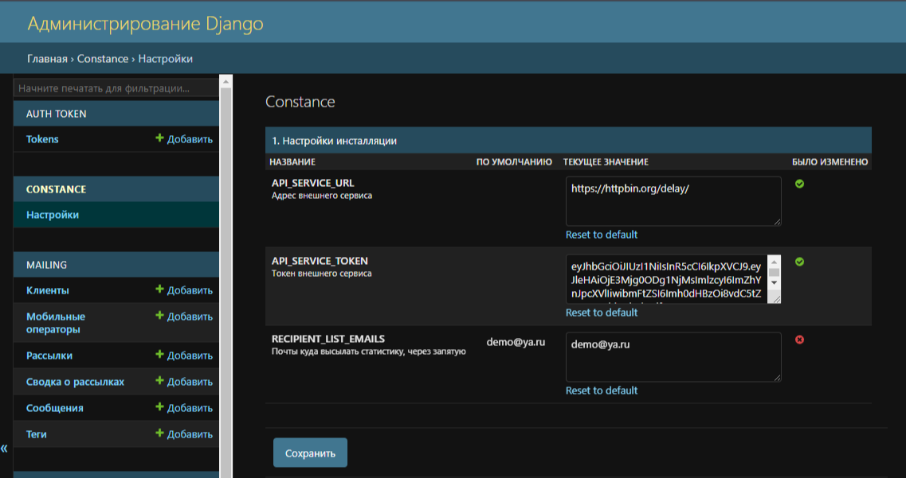
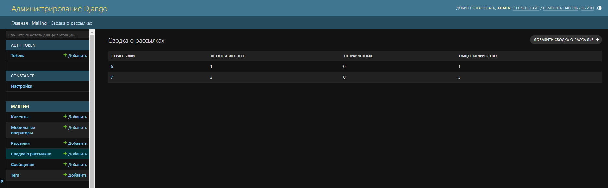
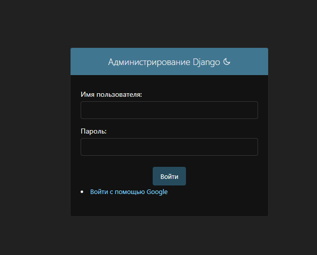
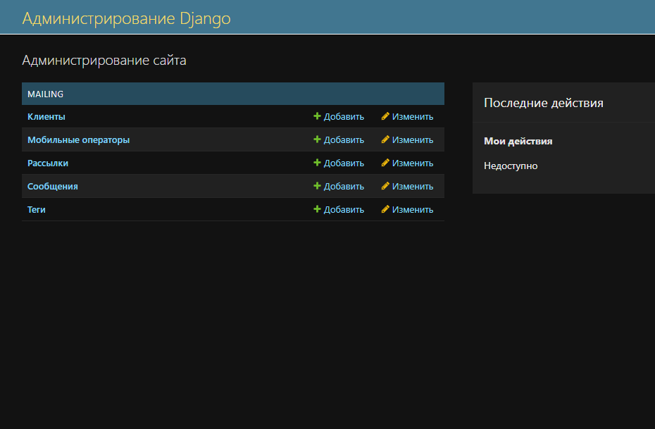

# Проект Notification - сервис уведомлений

## Технологии:
[](https://www.python.org/)
[](https://www.djangoproject.com/)
[](https://www.django-rest-framework.org/)
[](https://www.postgresql.org/)
[](https://nginx.org/ru/)
[](https://gunicorn.org/)
[](https://www.docker.com/)

Celery

## Описание

Сервис управления рассылками с поддержкой множественных каналов доставки уведомлений. Система обеспечивает надежную доставку сообщений через Email, SMS и Telegram с автоматическим fallback механизмом.

### Ключевые возможности

- **Множественные каналы доставки**: Email, SMS, Telegram
- **Надежная доставка с fallback**: если один способ не сработал, автоматически пробуется следующий
- **Умная маршрутизация**: система автоматически выбирает доступный канал доставки
- **Отслеживание способа доставки**: для каждого сообщения сохраняется информация о том, каким способом оно было доставлено
- **Гибкая фильтрация клиентов**: по операторам, тегам, часовым поясам
- **Автоматическое планирование**: рассылки запускаются автоматически по расписанию
- **Подробная статистика**: отслеживание статусов доставки и способов отправки

## Основные сущности

### Сущность "рассылка" имеет атрибуты:

* уникальный id рассылки
* дата и время запуска рассылки
* текст сообщения для доставки клиенту
* фильтр свойств клиентов, на которых должна быть произведена рассылка (код мобильного оператора, тег)
* дата и время окончания рассылки: если по каким-то причинам не успели разослать все сообщения - никакие сообщения клиентам после этого времени доставляться не должны

### Сущность "клиент" имеет атрибуты:

* уникальный id клиента
* номер телефона клиента в формате 7XXXXXXXXXX (X - цифра от 0 до 9)
* **email адрес** (опционально) - для отправки уведомлений по email
* **telegram_id** (опционально) - Telegram ID или username для отправки уведомлений в Telegram
* код мобильного оператора
* тег (произвольная метка)
* часовой пояс

### Сущность "сообщение" имеет атрибуты:

* уникальный id сообщения
* дата и время создания (отправки)
* статус отправки
* **способ доставки** - каким способом было доставлено сообщение (Email/SMS/Telegram)
* id рассылки, в рамках которой было отправлено сообщение
* id клиента, которому отправили

## Механизм доставки уведомлений

Система поддерживает **надежную доставку с автоматическим fallback**:

1. **Email** - первая попытка доставки через email (если у клиента указан email)
2. **SMS** - если email не сработал, пробуется SMS через внешний API
3. **Telegram** - если SMS не сработал, пробуется Telegram (если у клиента указан telegram_id)

### Порядок работы fallback механизма:

```
Попытка 1: Email
    ↓ (если не сработал)
Попытка 2: SMS
    ↓ (если не сработал)
Попытка 3: Telegram
    ↓ (если не сработал)
Повторная попытка через 6 минут (до 10 попыток)
```

Система автоматически пропускает недоступные каналы (например, если у клиента не указан email, сразу пробуется SMS).

## API

### Эндпоинты сервиса:

| Эндпоинт | Описание | Метод |
|----------|----------|-------|
| `/backend/clients/` | Просмотр всех клиентов | GET |
| `/backend/clients/` | Создание клиента | POST |
| `/backend/clients/{id}/` | Детальный просмотр клиента | GET |
| `/backend/clients/{id}/` | Полное обновление клиента | PUT |
| `/backend/clients/{id}/` | Частичное обновление клиента | PATCH |
| `/backend/clients/{id}/` | Удаление клиента | DELETE |
| `/backend/mailings/` | Просмотр всех рассылок | GET |
| `/backend/mailings/` | Создание рассылки | POST |
| `/backend/mailings/statistic/` | Общая статистика по всем рассылкам | GET |
| `/backend/mailings/{id}/statistics/` | Детальная статистика рассылки | GET |
| `/backend/mailings/{id}/` | Детальный просмотр рассылки | GET |
| `/backend/mailings/{id}/` | Полное обновление рассылки | PUT |
| `/backend/mailings/{id}/` | Частичное обновление рассылки | PATCH |
| `/backend/mailings/{id}/` | Удаление рассылки | DELETE |
| `/backend/tags/` | Просмотр всех тэгов | GET |
| `/backend/tags/` | Создание тэга | POST |
| `/backend/tags/{id}/` | Детальный просмотр тэга | GET |
| `/backend/tags/{id}/` | Полное обновление тэга | PUT |
| `/backend/tags/{id}/` | Частичное обновление тэга | PATCH |
| `/backend/tags/{id}/` | Удаление тэга | DELETE |
| `/backend/mobile_operators/` | Просмотр всех мобильных операторов | GET |
| `/backend/mobile_operators/` | Создание оператора | POST |
| `/backend/mobile_operators/{id}/` | Детальный просмотр оператора | GET |
| `/backend/mobile_operators/{id}/` | Полное обновление оператора | PUT |
| `/backend/mobile_operators/{id}/` | Частичное обновление оператора | PATCH |
| `/backend/mobile_operators/{id}/` | Удаление оператора | DELETE |

## Логика рассылки

* После создания новой рассылки, если текущее время больше времени начала и меньше времени окончания - должны быть выбраны из справочника все клиенты, которые подходят под значения фильтра, указанного в этой рассылке и запущена отправка для всех этих клиентов.
* Если создаётся рассылка с временем старта в будущем - отправка должна стартовать автоматически по наступлению этого времени без дополнительных действий со стороны пользователя системы.
* По ходу отправки сообщений должна собираться статистика (см. описание сущности "сообщение" выше) по каждому сообщению для последующего формирования отчётов.
* **Надежная доставка**: система автоматически пробует разные способы доставки (Email → SMS → Telegram), если один не сработал.
* В случае неудачной отправки всеми способами, применяется тактика повторных попыток: задача повторно запускается с интервалом 6 минут и не более 10 попыток до успешного ответа или если время рассылки вышло.
* Отправка сообщений происходит в указанный интервал с учетом часового пояса клиента.
* Каждое утро в 5:30 отправляется статистика за прошедшие сутки на указанные в админке в разделе Constance электронные почты.

## Настройка каналов доставки

### Email

Для отправки через email, заполните файл `.env` данными:

```env
EMAIL_HOST=smtp.example.com
DEFAULT_FROM_EMAIL=noreply@example.com
EMAIL_HOST_USER=your_email@example.com
EMAIL_HOST_PASSWORD=your_password
EMAIL_PORT=587
```

### SMS

Для отправки через SMS используется внешний API. Настройте в админке Django (раздел Constance) или в `.env`:

```env
API_SERVICE_URL=https://probe.fbrq.cloud/v1/send/
API_SERVICE_TOKEN=your_jwt_token
```

OpenAPI спецификация внешнего сервиса: https://probe.fbrq.cloud/docs

### Telegram

Для отправки через Telegram:

1. Создайте бота через [@BotFather](https://t.me/BotFather) в Telegram
2. Получите токен бота
3. Добавьте токен в настройки:

**Через админку Django:**
- Перейдите в раздел Constance → Настройки инсталляции
- Укажите `TELEGRAM_BOT_TOKEN`

**Или через `.env` файл:**
```env
TELEGRAM_BOT_TOKEN=1234567890:ABCdefGHIjklMNOpqrsTUVwxyz
```

4. Для клиентов укажите `telegram_id`:
   - Числовой ID пользователя (например: `123456789`)
   - Или username (например: `@username` или `username`)

## Документация

### Работа с админкой

Добавить настройки сервисов в Django admin, в разделе Constance. 

**Порядок работы:**

1. Создайте тэги и мобильных операторов
2. Создайте клиентов, указав:
   - Оператора (обязательно)
   - Тег (опционально)
   - Email (опционально, для доставки через email)
   - Telegram ID (опционально, для доставки через Telegram)
3. Создайте рассылки:
   - Укажите теги или мобильных операторов для фильтрации
   - Если не указать фильтры, рассылка будет отправлена всем клиентам
   - После создания автоматически создаются запланированные задачи (django-celery-beat) на каждый день в количестве указанных дней

**Статистика по отправленным сообщениям** в административном интерфейсе. 

**Авторизация** в административный интерфейс возможна через Google account. 

Что видит пользователь после авторизации через google. 

## Запуск проекта

### Настройка OAuth (опционально)

Для авторизации через Google (если авторизация не нужна, можете пропустить этот этап):

1. Пройдите по адресу https://console.cloud.google.com/projectcreate - укажите произвольное название проекта
2. После создания проекта выберите в разделе APIs and services подпункт Credentials
3. Выберите CREATE CREDENTIALS и выберите OAuth client ID
4. Вы будете перенаправлены на oauth consent screen, выберите External в поле UserType и нажмите CREATE
5. В разделе Appname укажите произвольное название проекта и введите свой адрес электронной почты в поле User support email
6. В разделе Authorised domains введите localhost
7. Сохраните до момента сводной информации, там нажмите back to dashboard
8. В меню на левой боковой панели нажмите по Credentials и снова по Create credentials, а затем на OAuth client ID
9. Введите следующую информацию:
   * Application type: выберите Web application
   * Name: укажите произвольное название проекта
   * Authorized JavaScript origins: https://localhost
   * Authorised redirect URIs: https://localhost/backend/social-auth/complete/google-oauth2/
10. Нажмите CREATE. Вы получите ключи Your Client ID и Your Client Secret

### Настройка окружения

Создайте файл `.env` и заполните необходимыми параметрами:

```env
SECRET_KEY=your_key
DEBUG=0
DB_NAME=postgres
POSTGRES_USER=postgres
POSTGRES_PASSWORD=postgres
DB_HOST=db
DB_PORT=5432
REDIS_HOST=redis

# OAuth (опционально)
SOCIAL_AUTH_GOOGLE_OAUTH2_KEY=your_client_id
SOCIAL_AUTH_GOOGLE_OAUTH2_SECRET=your_client_secret

# Настройки сервисов
ALLOWED_HOSTS=localhost,127.0.0.1
API_SERVICE_URL=https://probe.fbrq.cloud/v1/send/
API_SERVICE_TOKEN=your_jwt_token
RECIPIENT_LIST_EMAILS=demo@ya.ru,admin@example.com
TIME_ZONE=Asia/Yekaterinburg

# Email настройки
EMAIL_HOST=smtp.example.com
DEFAULT_FROM_EMAIL=noreply@example.com
EMAIL_HOST_USER=your_email@example.com
EMAIL_HOST_PASSWORD=your_password
EMAIL_PORT=587

# Telegram настройки
TELEGRAM_BOT_TOKEN=your_telegram_bot_token
```

### Запуск через Docker

1. Клонируйте репозиторий, перейдите в папку, установите docker и docker-compose если нужно
2. Запустите приложения в контейнерах:

```bash
docker-compose up --build
```

или для запуска в фоновом режиме:

```bash
docker-compose up -d --build
```

3. После успешной сборки выполните команды:

**Выполните миграции:**
```bash
docker-compose exec web python manage.py migrate
docker-compose exec backend python manage.py collectstatic --no-input
```

**Создайте суперпользователя Django:**
```bash
docker-compose exec web python manage.py createsuperuser
```

4. Проект будет доступен по адресам:
   * https://localhost/ - главная страница
   * https://localhost/backend/admin - админка
   * https://localhost/backend/docs/ - Swagger UI
   * http://localhost:5555/ - Flower (мониторинг Celery)

5. Остановить контейнеры:
```bash
docker-compose stop
```

### Запуск на локальном хосте

1. Клонируйте репозиторий, перейдите в папку, создайте виртуальное окружение:

```bash
python3 -m venv venv
source venv/bin/activate    # для macos, linux
source venv/Scripts/activate    # windows
```

2. Установите зависимости:

```bash
pip install --upgrade pip
pip install -r requirements.txt
```

3. Настройте базу данных:
   - Если нужно использовать SQLite вместо PostgreSQL, уберите `DB_NAME`, `POSTGRES_USER`, `POSTGRES_PASSWORD`, `DB_HOST`, `DB_PORT` из `.env`
   - Также не заполняйте `REDIS_HOST` в `.env` или указывайте `localhost`

4. Выполните миграции:

```bash
python manage.py migrate
```

5. Создайте администратора:

```bash
python manage.py createsuperuser
```

6. Запустите Redis:

```bash
redis-cli
```

Если redis находится в docker:

```bash
docker start redis
```

7. Запустите Celery worker:

**Linux, macOS:**
```bash
celery -A notification worker -l info
```

**Windows:**
```bash
celery -A notification worker -l info -P solo
```

8. Запустите django-celery-beat:

```bash
celery -A notification beat -l info
```

9. (Опционально) Запустите мониторинг Celery:

```bash
celery -A notification flower
```

10. Запустите приложение:

```bash
python manage.py runserver
```

Для запуска с HTTPS протоколом (для авторизации через OAuth):

```bash
python manage.py runserver_plus --cert-file ssl/cert.crt 8000
```

> **Примечание:** Самописный сертификат в проекте сгенерирован с помощью openssl.

## Дополнительные возможности

Выполненные опциональные пункты:

1. ✅ Организовано тестирование написанного кода
2. ✅ Обеспечена автоматическая сборка/тестирование с помощью GitLab CI
3. ✅ Подготовлен docker-compose для запуска всех сервисов проекта одной командой
4. ✅ Реализована страница Swagger UI по адресу `/docs/` с описанием разработанного API
5. ✅ Реализован администраторский Web UI для управления рассылками и получения статистики по отправленным сообщениям
6. ✅ Обеспечена интеграция с внешним OAuth2 сервисом авторизации для административного интерфейса (Google OAuth)
7. ✅ Реализован дополнительный сервис, который раз в сутки отправляет статистику по обработанным рассылкам на email
8. ✅ Организована обработка ошибок и откладывание запросов при неуспехе для последующей повторной отправки
9. ✅ Реализована дополнительная бизнес-логика: временной интервал для рассылок с учетом часового пояса клиента
10. ✅ Обеспечено подробное логирование на всех этапах обработки запросов

## Автор

Selivanov Dmitry
